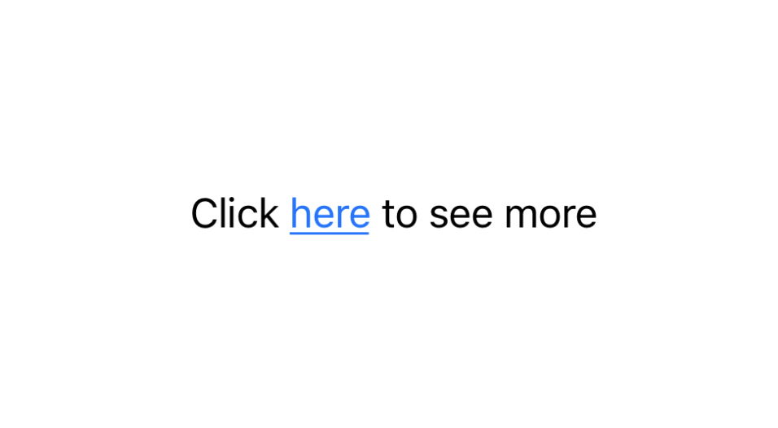

# AttributedText

AttributedText is a SwiftUI library that simplifies the creation of mixed-style text by wrapping SwiftUI's native AttributedString. It provides a more convenient way to create text with multiple styles and adds an easy-to-use tap handling functionality.

## Preview





## Features

- Simplified API for creating mixed-style text
- Built on top of SwiftUI's native AttributedString
- Easy text concatenation with style preservation
- Convenient tap event handling with `.onTap` modifier
- Custom text styling support
- Fully SwiftUI compatible

## Requirements

- iOS 15.0+
- macOS 12.0+
- Swift 5.10+

## Installation

### Swift Package Manager

In Xcode, select File > Add Packages... and enter the repository URL:

```
https://github.com/ziming-nutpie/AttributedText.git
```

## Usage Examples

### Basic Usage

```swift
AttributedText("Hello World")
```

### Adding Styles

```swift
AttributedText("Styled Text") { text in
    text.foregroundColor = .green
}
```

### Adding Tap Events

```swift
AttributedText("Clickable Text")
    .onTap {
        print("Text tapped!")
    }
```

### Text Concatenation

```swift
AttributedText("Hello ")
    +
AttributedText("World") { text in
    text.foregroundColor = .blue
}
    .onTap {
        print("World tapped!")
    }
```

## Complete Example

```swift
Group {
    AttributedText("Test ")
        +
    AttributedText("Tappable Text") { text in
        text.foregroundColor = .green
    }
    .onTap {
        print("Test")
    }
        +
    AttributedText(" Short")
}
.font(.system(size: 28))
```

## License

MIT License

Copyright (c) 2024 Ziming Liu

Permission is hereby granted, free of charge, to any person obtaining a copy
of this software and associated documentation files (the "Software"), to deal
in the Software without restriction, including without limitation the rights
to use, copy, modify, merge, publish, distribute, sublicense, and/or sell
copies of the Software, and to permit persons to whom the Software is
furnished to do so, subject to the following conditions:

The above copyright notice and this permission notice shall be included in all
copies or substantial portions of the Software.

THE SOFTWARE IS PROVIDED "AS IS", WITHOUT WARRANTY OF ANY KIND, EXPRESS OR
IMPLIED, INCLUDING BUT NOT LIMITED TO THE WARRANTIES OF MERCHANTABILITY,
FITNESS FOR A PARTICULAR PURPOSE AND NONINFRINGEMENT. IN NO EVENT SHALL THE
AUTHORS OR COPYRIGHT HOLDERS BE LIABLE FOR ANY CLAIM, DAMAGES OR OTHER
LIABILITY, WHETHER IN AN ACTION OF CONTRACT, TORT OR OTHERWISE, ARISING FROM,
OUT OF OR IN CONNECTION WITH THE SOFTWARE OR THE USE OR OTHER DEALINGS IN THE
SOFTWARE. 